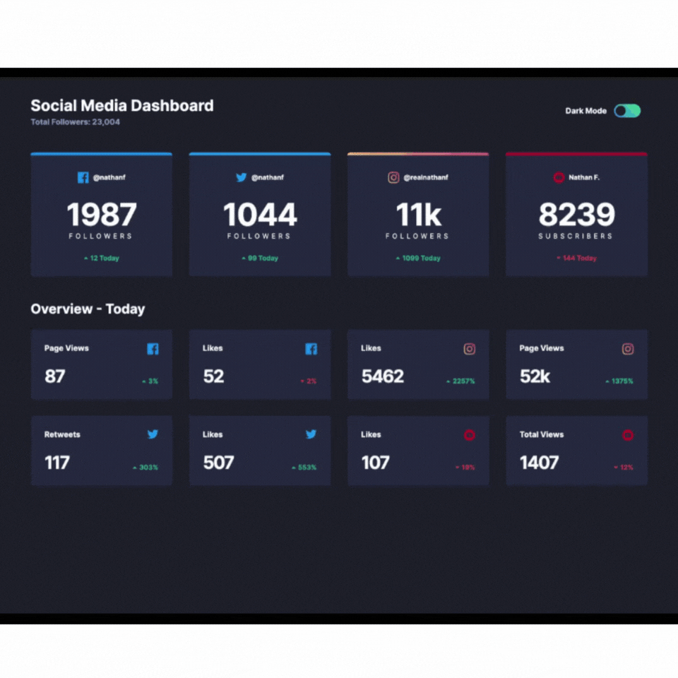

# Frontend Mentor - Social media dashboard with theme switcher solution

This is a solution to the [Social media dashboard with theme switcher challenge on Frontend Mentor](https://www.frontendmentor.io/challenges/social-media-dashboard-with-theme-switcher-6oY8ozp_H). Frontend Mentor challenges help you improve your coding skills by building realistic projects.

## Table of contents

- [Overview](#overview)
  - [The challenge](#the-challenge)
  - [Screenshot](#screenshot)
  - [Links](#links)
- [My process](#my-process)
  - [Built with](#built-with)
  - [Useful resources](#useful-resources)
- [Author](#author)

## Overview

### The challenge

Users should be able to:

- View the optimal layout for the site depending on their device's screen size
- See hover states for all interactive elements on the page
- Toggle color theme to their preference

### Screenshot

### Links

- Solution URL: [https://www.frontendmentor.io/solutions/social-media-dashboard-w-theme-toggle-mobile-first-design-VJ9I7R5IoX)
- Live Site URL: [https://seangray-dev.github.io/FEM-Social-Media-Dashboard/)

## My process

### Built with

- Semantic HTML5 markup
- CSS custom properties
- SASS / SCSS
- Flexbox
- CSS Grid
- Mobile-first workflow

### Useful resources

- [Accesbile Option/Toggle Switch](https://codepen.io/SaraSoueidan/pen/jpBbrq/) - This helped me for accessibility reasons. I really Sara;s approach and will use it going forward.

## Author

- Frontend Mentor - [@seangray-dev](https://www.frontendmentor.io/profile/seangray-dev)
- Twitter - [@seangray_dev](https://twitter.com/seangray_dev)
